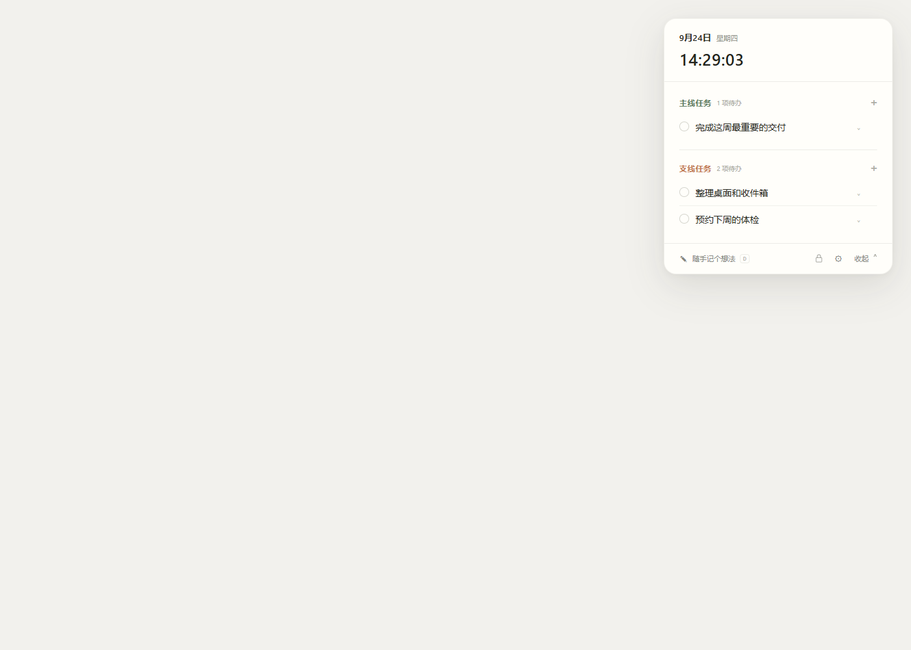

# 主线 / 支线
就一句话，我受够了各种各样的todolist里面乱七八糟的功能了

## 就做这些

- 记录主线、支线待办和截止日期
- 查看并编辑每周课表；不需要时可以关闭
- 勾选完成，并为任务补充简短说明
- 内容保存在当前浏览器本地，不会上传

## 使用

下载或克隆仓库，直接用现代浏览器打开 `index.html`。无需构建或安装依赖。更换设备或清理浏览器数据前，请自行备份；本项目不提供云同步。

## 许可与素材

项目源代码以 MIT License 发布，见 [LICENSE](LICENSE)。主题插画和其他视觉素材不因源代码许可而自动转让或获得再许可；如需再分发，请先确认各素材的权利状态。ANU 校徽素材的来源及许可见 [`themes/ANU-crest-attribution.txt`](themes/ANU-crest-attribution.txt)：Wikimedia Commons，CC BY-SA 4.0。

## 桌面安装包

在 GitHub Releases 下载 Windows 安装程序，或下载 macOS 通用 DMG（同时支持 Apple Silicon 与 Intel Mac）。安装后应用数据保存在本机，不会上传。

macOS 安装包目前未使用 Apple Developer ID 签名与公证；首次打开时，macOS 可能会显示安全提示。可在系统设置中确认后打开应用。

开发启动：`npm install` 后运行 `npm start`。桌面发布包由 GitHub Actions 在推送 `v*` 版本标签时自动构建并发布。
